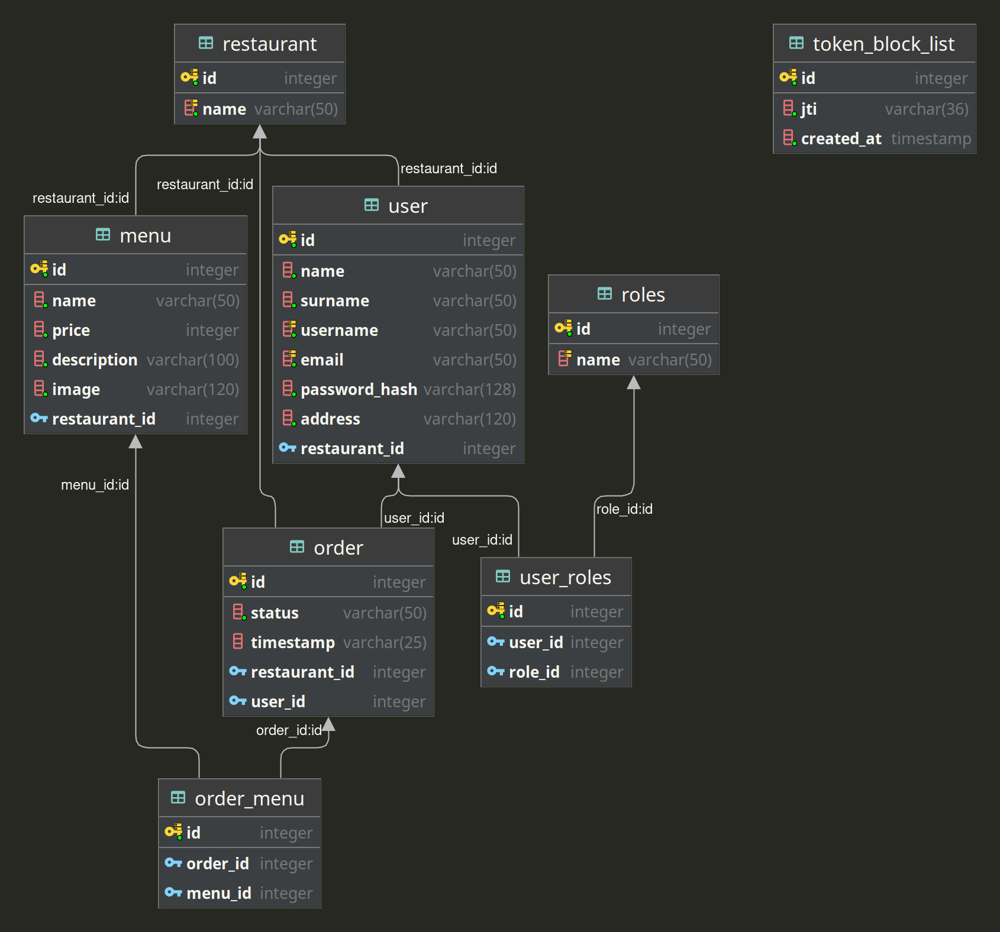

<h1 align="center"> Burgerzilla </h1>
<h2 align="center"> Python & Flask Web Development Capstone Project </h2>

### Overview

It is a REST-API micro-service that takes orders from hamburger restaurants registered under Burgerzilla, can view the
status of the order, and enables transactions with the customer or restaurant authority regarding the order.

You can reach the requirements of the given project in Turkish
from [this file](yemeksepeti-python-bootcamp-capstone-project.pdf).

You can find the main repository of this project [here](https://github.com/TheNavyInfantry/Burgerzilla-Yemeksepeti).

---

### Core packages used in the main build

* [Flask](https://flask.palletsprojects.com/en/2.0.x/)
* [Flask-RESTX](https://flask-restx.readthedocs.io/en/latest/)
* [Flask-JWT-Extended](https://flask-jwt-extended.readthedocs.io/en/stable/)
* [Flask-SQLAlchemy](https://flask-sqlalchemy.palletsprojects.com/en/2.x/)
* [Flask-Migrate](https://flask-migrate.readthedocs.io/en/latest/)

---

### Installation

1. Clone this repository

```
https://github.com/Yemeksepeti-Python-Bootcamp/burgerzilla_nedimcanulusoy.git
```

2. There are two ways to run project

    1. **Production** (**Recommended** for stable and live usage):
        * Run with `docker-compose -f docker-compose.prod.yml up`

    2. **Development** (Choose this if you want to do experimental tests or develop this project.):
        * Create a virtual environment with `virtualenv venv`
        * Install requirements with `pip3 install -r requirements.txt`
        * Run PostgreSQL Database with `docker-compose up`
        * Run Flask with `python3 -m flask run`

---
**Warning**: If you run into any problems running prod or dev docker, do the following in order;

* `docker-compose down`
* `docker system prune -a`
* `sudo rm -rf .postgres_data_dev`
* `sudo rm -rf .postgres_data_prod`

and run your docker again.

---

### Endpoints

#### Auth Endpoints

| Method | Endpoint    | Description                        |
| :-------- | :------- | :-------------------------------- | 
| `POST`| `http://localhost/auth/login` | User Login | 
| `POST`| `http://localhost/auth/logout` | User Logout |
| `POST`| `http://localhost/auth/register` | User Register |

---

#### Customer Endpoints

| Method | Endpoint    | Description                        |
| :-------- | :------- | :-------------------------------- | 
| `POST`| `http://localhost/customer/order` | Creates a new order basket if not exists any new | 
| `GET`| `http://localhost/customer/order` | Returns details of current order basket if exists |
| `POST`| `http://localhost/customer/order/cancel` | Cancels current order basket if exists |
| `POST`| `http://localhost/customer/order/delete` | Deletes order from customer's history |
| `POST`| `http://localhost/customer/order/add` | Adds specified menu to current order basket if exists |
| `POST`| `http://localhost/customer/order/menu/remove` | Removes specific menu from current order basket if exists |
| `GET`| `http://localhost/customer/orders` | Returns order history of customer |

---

#### Restaurant Endpoints

| Method | Endpoint    | Description                        |
| :-------- | :------- | :-------------------------------- | 
| `POST`| `http://localhost/restaurant/{restaurant_id}/menu` | Adds a new menu to the restaurant | 
| `GET`| `http://localhost/restaurant/{restaurant_id}/menu/{menu_id}` | Returns detail of specified menu |
| `DELETE`| `http://localhost/restaurant/{restaurant_id}/menu/{menu_id}` | Delete existing menu from restaurant |
| `PUT`| `http://localhost/restaurant/{restaurant_id}/menu/{menu_id}` | Update the specified menu |
| `GET`| `http://localhost/restaurant/{restaurant_id}/menus` | Returns the menu according to the ID of the restaurant |
| `POST`| `http://localhost/restaurant/{restaurant_id}/order/{order_id}/cancel` | Cancel user's order by restaurant |
| `GET`| `http://localhost/restaurant/{restaurant_id}/order/{order_id}/detail` | Returns order details of the user to the Restaurant |
| `PUT`| `http://localhost/restaurant/{restaurant_id}/order/{order_id}/status` | Updates the status of the order by the restaurant |
| `GET`| `http://localhost/restaurant/{restaurant_id}/orders` | Returns which menu order was taken |

---

#### Menus Endpoints

| Method | Endpoint    | Description                        |
| :-------- | :------- | :-------------------------------- | 
| `GET`| `http://localhost/menus/all` | Return all menus of all restaurants | 

---

#### Restaurants Endpoints

| Method | Endpoint    | Description                        |
| :-------- | :------- | :-------------------------------- | 
| `GET`| `http://localhost/restaurants` | Returns all restaurants | 

---

### API Documentation

#### a) Swagger

When you start the application, you will be able to do all endpoint operations on the same page via swagger. Since the
swagger interface is very useful, easy and fast, you can easily test the endpoints and look at the documentation. All
you have to do is use the token you received after logging in for your requests.

#### b) Postman

It is also possible to try endpoint operations on postman. Also, I recommend that you do not forget to enter your
required token and other parameters besides body.

You can either try it with `Burgerzilla_Yemeksepeti.postman_collection.json` file on Postman or with the button below on
Postman's website.

[](https://app.getpostman.com/run-collection/317edb4eaa7b0575352d?action=collection%2Fimport)

---

### Project Structure

```
Burgerzilla-Yemeksepeti
├─ app.py
├─ burgerzilla
│  ├─ __init__.py
│  ├─ api_models.py
│  ├─ config.py
│  ├─ models.py
│  ├─ order_status.py
│  └─ routes
│     ├─ __init__.py
│     ├─ auth
│     │  ├─ __init__.py
│     │  ├─ login.py
│     │  ├─ logout.py
│     │  └─ register.py
│     ├─ customer.py
│     ├─ menus.py
│     ├─ restaurant.py
│     ├─ restaurants.py
│     └─ utils.py
├─ Dockerfile
├─ docker-compose.prod.yml
├─ docker-compose.yml
├─ docker-entrypoint.sh
├─ init.sql
├─ migrations
│  ├─ README
│  ├─ alembic.ini
│  ├─ env.py
│  ├─ script.py.mako
│  └─ versions
│     └─ 57b09b39797a_init.py
├─ .gitignore
├─ LICENSE
├─ README.md
├─ bzdata.png
├─ yemeksepeti-python-bootcamp-capstone-project.pdf
└─ requirements.txt

```

---

### Database Diagram

<p align="center"></p>